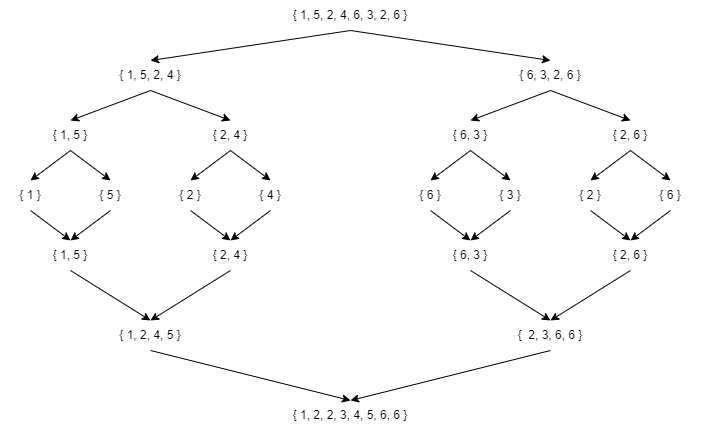

# Dziel i zwyciężaj

Jest najczęściej wykorzystywaną metoda projektowania algorytmów. Zgodnie z jej nazwą pierwsza rzeczą jaką trzeba zrobic jest **podzielenie** problemu na mniejsze części, a za ich pomocą zostanie przedstawione rozwiązanie. 

Dopiero na końcowym etapie następuje scalenie małych kroków w jeden gotowy algorytm.

### Cechy metody:

- Prowadzi do bardzo efektywnych rozwiązań,
- Polega na rekurencjnym dzieleniu problemu na dwa mniejsze,
- Dzielenie trwa tak długo, aż podproblemy stają się bezpośrednim rozwiązaniem,
- Podproblemy są "mniejszymi kopiami",
- Oficjalnie zastosowano tą metodę w 1960 roku.

### Dlaczego jest najbardziej popularna

Ponieważ algorytmy zbudowane przy użyciu tej metody mają najmniejszą złożonośc obliczeniową.

Zasada jest wykorzystywana w sortowaniu i wyszukiwaniu elementów.

### Sposób działania

Algorytm sprawdza, czy w podanej, posortowanej tablicy znajduje się element o danej wartości

- Tablica jest dzielona na coraz mniejsze elementy,
- Potencjalnym elementem do wyszukania jest element środkowy,
- W zależności od wartości elementu środkowego, kontynuuje się przeszukiwanie odpowiedniej części tablicy,
- Podział kończy się, gdy znajdziemy szukany element, lub gdy przedział osiągnie długość 0.

