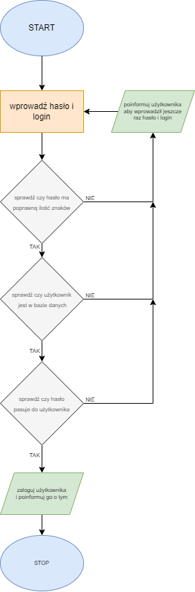

# Algorytmy

Algorytm to jednoznacznie określony ciąg czynności potrzebnych do wykonania zadania

### Cechy algorytmu
- skończoność <sub>sup>musi dojść do końca w określonym czasie</sup></sub>
- określoność <sub>sup>musi zwracać zawsze takie same dane wyjściowe dla tych samych danych wejściowych</sup></sub>
- efektywność <sub>sup>powinien zwrócić wynik w najmniejeszej liczbie kroków</sup></sub>
- poprawność <sub><sup>wynik zwrócony przez algorytm musi być za każdym razem poprawny</sup></sub>

### Schemat blokowy algorytmu

Jest najprostszym sposobem zobrazowania algorytmu.<br/>
Głównymi elementami schematów blokowych są:
- Owal <sub><sup>punkt rozpoczęcia/zakończenia algorytmu</sup></sub>
- Strzałka <sub><sup>pokazuje kierunek kolejności wykonywania</sup></sub>
- Romb <sub><sup>w jego wnętrzu znajdują się wyłącznie instrukcje warunkowe</sup></sub>
- Prostokąt <sub><sup>operator, zawiera wszystkie możliwe obliczenia, opisy kroków</sup></sub>

**Schemat blokowy** przedstawia algorytm w postaci kilku symboli graficznych. Podaje szczegółowo wszystkie operacje arytmetyczne, logiczne, przesyłania, sterujące i pomocnicze wraz z kolejnością wykonania.

### Lista kroków algorytmu

Przedstawienie algorytmu w kolejnych punktach *(krokach)*. Każdy punkt takiej listy zawiera oppis wykonywanej czynności. Kolejność punktów nie może być przypadkowa - musi być zgodna z działaniem algorytmu.

**przykładowy algorytm:**
```
1. Użytkownik wprowadza hasło
2. Sprawdź czy hasło poprawne 
    Tak - przejdź do kroku 3, 
    Nie - przejdź do kroku 1
3. Poifnormuj użytkownika o zalogowaniu
```


