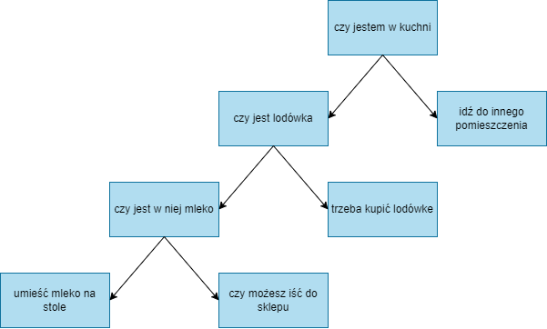

# Algorytmy

Algorytm to jednoznacznie określony ciąg czynności potrzebnych do wykonania zadania

### Cechy algorytmu
- skończoność <sub><sup>musi dojść do końca w określonym czasie</sup></sub>
- określoność <sub><sup>musi zwracać zawsze takie same dane wyjściowe dla tych samych danych wejściowych</sup></sub>
- efektywność <sub><sup>powinien zwrócić wynik w najmniejeszej liczbie kroków</sup></sub>
- poprawność <sub><sup>wynik zwrócony przez algorytm musi być za każdym razem poprawny</sup></sub>

### Schemat blokowy algorytmu

Jest najprostszym sposobem zobrazowania algorytmu.<br/>
Głównymi elementami schematów blokowych są:
- Owal <sub><sup>punkt rozpoczęcia/zakończenia algorytmu</sup></sub>
- Strzałka <sub><sup>pokazuje kierunek kolejności wykonywania</sup></sub>
- Romb <sub><sup>w jego wnętrzu znajdują się wyłącznie instrukcje warunkowe</sup></sub>
- Prostokąt <sub><sup>operator, zawiera wszystkie możliwe obliczenia, opisy kroków</sup></sub>

**Schemat blokowy** przedstawia algorytm w postaci kilku symboli graficznych. Podaje szczegółowo wszystkie operacje arytmetyczne, logiczne, przesyłania, sterujące i pomocnicze wraz z kolejnością wykonania.

### Lista kroków algorytmu

Przedstawienie algorytmu w kolejnych punktach *(krokach)*. Każdy punkt takiej listy zawiera oppis wykonywanej czynności. Kolejność punktów nie może być przypadkowa - musi być zgodna z działaniem algorytmu.

**przykładowy algorytm:**
```
1. Użytkownik wprowadza hasło
2. Sprawdź czy hasło poprawne 
    Tak - przejdź do kroku 3, 
    Nie - przejdź do kroku 1
3. Poifnormuj użytkownika o zalogowaniu
```


### Sposoby zapisu algorytmów

#### Pseudojęzyk programowania
jest to sposób zapisu algorytmu, który zachowując strukturę charakterystyczną dla kodu zapisanego w języku programowania, rezygnuje ze ścisłych reguł składniowych na rzecz prostoty i czytelności.

<sub><sup>**algorytm znajdujący najmniejszą liczbę**</sup></sub>
```cpp
#include <iostream>

int getMin(int a, int b) {
	int c = a < b ? a : b;
	return c;
}

int a, b;
int main() {
	std::cout << "Podaj liczbe a: "; std::cin >> a;
	std::cout << "Podaj liczbe b: "; std::cin >> b;
	std::cout << "Liczba " << getMin(a, b) << " jest mniejsza!\n";
	return 0;
}
```

#### Lista kroków

<sub><sup>**lista kroków wyjmowania mleka z lodówki**</sup></sub>
```cpp
#include <iostream>
#include <vector>
#include <string>

int main(){
    const	std::vector<std::string> getMilkAlgo = {
		"Znajdz lodowke",
		"Otworz lodowke",
		"Wyciagnij mleko",
		"Zamknij lodowke",
		"Postaw mleko",
	};
	for (int i = 0; i < getMilkAlgo.size(); i++) {
		std::cout << i+1 << ". " << getMilkAlgo[i] << std::endl;
	}
    return 0;
}
```

#### Drzewo decyzyjne
Najczęściej wybieranym graficznym elementem procesu decyzyjnego stosowanym przy tzw. uczeniu maszynowym oraz w obliczaniu prawdopodobieństaw jest drzewo decyzyjne. Jest to odwzorowanie wszystkich kroków/decyzji za pomocą schematu przypominającego drzewo, patrząc od korzenia (przy czym korzeń wytępuje w tym przypadku u góry schematu. Każda gałąź to droga do decyzji, które obrazuje liść).


