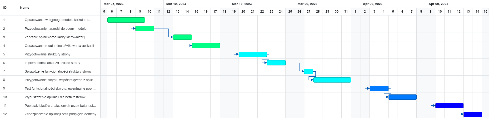

# Diagram Gantta
Kroki:
- Utworzenie listy zadań, które mają być wykonane w projekcie,
- Przypisanie do nich osoby odpowiedzialnej za projekt,
- Oszacowanie ile dni roboczych będzie trwało dane zadanie,
- Określenie od jakich zadań zależy rozpoczecie konkretnego zadania - jego poprzedniki,
- Określenie, kiedy startuje pierwsze zadanie w projekcie,
- Na podstawie tych informacji uzupełniasz daty rozpoczęcia i zakończenia poszczególnych zadan. 

