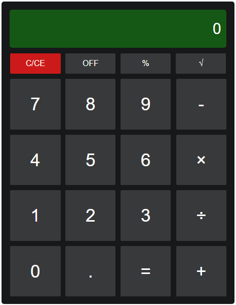

# Kalkualtor w HTML
Program wykonujący obliczenia na liczbach całkowitych i zmiennoprzecinkowych.

<br/>

### Słownik
- *LoadButtons()* - załadowanie przycisków w kalkulatorze
- *UseButton()* - funkcja odczytująca wciśniety przycisk
- *useSymbol()* - funkcja zapisująca do operacji dany symbol
- *useNumber()* - funkcja zapisująca do operacji daną liczbe
- *calculate()* - funkcja sprawdzająca liczbę widoczną w polu wyniku
- *operation()* - funkcja wykonująca operacje na liczbach
<br/>

### Opis
- Aplikacja działa w języku JS z pomocą HTML oraz CSS
- System odczytuje przyciski które wciska użytkownik, a następnie wykonuje operacje
- Aplikacja może być używana przez każdego użytkownika
- Jest ona kompatybilna z każdym systemem operacyjnym, który ma możliwość skorzystania z przeglądarki internetowej obsługującej javascript

<br/>

### Wymagania funkcjonalne
- Funkcjonalność - operation()
- Opis - jest wykorzystywania do operacji na liczbach
- Wejscie - Wcisniete przyciski
- Wyjscie - Wynik operacji na liczbach
- Efekty uboczne - można łatwo zmanipulować skrypt poprzez wejśćie w zbadaj element, zmanipulowany skrypt wykonuje się tylko u tej samej osoby do momentu odświeżenia strony

<br/>

### Wymagania niefunkcjonalne
- Każdy możliwy system, który posiada oraz jest w stanie uruchomić przeglądarke internetową obsługująca javascript
- Aplikacja jest w stanie działać na słabym sprzęcie
- Brak ograniczeń prawnych
- Program nie ma żadnych problemów z wydajnością, gdy jest on poprawnie użytkowany

<br/>

### Pliki źródłowe

wykorzystano: `HTML5, CSS3, JavaScript`<br/>
główny plik: `./views/index.html`<br/>
skrypt: `./public/js/scripts/calcualtor.js`<br/>
arkusz styli: `./public/css/style.css`

Kalkulator został zrobiony w formacie:
```js
calculatorButtons = [
        button_clear, button_off, button_modulo, button_sqrt,
        number_7, number_8, number_9, button_substract,
        number_4, number_5, number_6, button_multiply,
        number_3, number_2, number_1, button_divide,
        number_0, button_dot, button_solve, button_add
    ];
```

### GUI Kalkulatora


Legenda:
```
[Zielony prostokąt] - wyświetla wszystkie operacje
[C/CE] - Wyczyść
[OFF] - Wyłącz (włączenie poprzez C/CE)
[%] - Modulo
[√] - Pierwiastek
[-] - Odejmowanie
[x] - Mnożenie
[÷] - Dzielenie
[+] - Dodawanie
[0-9] - Dopisywanie liczb do działania
[.] - Działanie zmiennoprzecinkowe
[=] - Wynik działania
```
