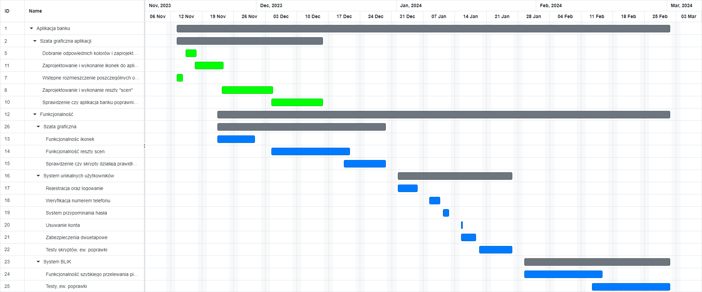

# Harmonogram testów
Jest to lista aktywności, zadań lub zdarzeń z procesu testowego, określająca ich zamierzoną datę rozpoczecia i zakończenia <sub><sup>*i / lub czas*</sup></sub>, oraz ich współzależności


- [Harmonogram testów](#Harmonogram%20testów)
  - [Przypadki testowe](#Przypadki%20testowe)
  - [Procedury testowe](#Procedury%20testowe)
  - [Zakres testów](#Zakres%20testów)
  - [Harmonogram do aplikacji](#Harmonogram%20do%20aplikacji)


### Przypadki testowe

**Atrybut**    | **Opis**
-------------  | -------------
**ID** | Unikalny identyfikator przypadku testowego
**Elementy testowe** | Lista elementów (warunków testowych) weryfikowanych przez dany przypadek testowy
**Specyfikacja wejścia** | Określenie informacji wejściowych wymagań do wykonania przypadku testowego
**Specyfikacja wyjścia** | Określenie informacji wyjściowych po wykonaniu testu, np. wynik
**Potrzeby środowiskowe** | Opis wymagań dotyczących środowiska
**Specjalne wymagania proceduralne** | Lista wszelkich ograniczeń i wymagań
**Zależności między przypadkami testowymi** | Lista przypadków testowych

### Procedury testowe

**Atrybut**    | **Opis**
-------------  | -------------
**ID** | Unikalny identyfikator procedury
**Cel** | Opis celu procedury oraz odniesienie się do przypadku testowego
**Specjalne wymagania** | - określenie czy procedura ma być wykonywana manualnie, czy jest elementem skryptów automatycznych<br/>- opis etapu w której procedura ma być wykonywana<br/>- środowisko testowe niezbędne do uruchomienia procedury<br/>- specjalne umiejętności wymagane do uruchomienia procedury
**Kroki procedury** | - logowanie do systemu<br/>- ustawienie środowiska<br/>- uruchomienie<br/>- wykonywanie testu<br/>- pomiary wyników testu<br/>- podsumowanie<br/>- zależności

### Zakres testów

- Akceptowanie/odrzucanie reklam
- Dodawanie nowego kontaktu do listy
- Oglądanie statystyk
- Blokowanie kont użytkowników
- Dodawanie adresów do czarnej listy
- Edycja reklamy
- Kasowanie e-maili
- Przeglądanie zgłoszeń
- Usuwanie adresów z czarnej listy
- Definiowanie kolorów i dźwięków
- Definiowanie reguł autoprzetwarzania
- Definiowanie skrótów klawisozwych
- Deklarowanie jako spam
- Dodawanie załączników
- Edytowanie wiadomości

### Harmonogram do aplikacji

**APLIKACJA BANKU**

Aplikacja służy do łatwiejszego zarządzania swoimi pieniędzmi. Można za darmo założyć w niej swoje własne konto bankowe. W aplikacji można sprawdzić swój stan pieniędzy, wysłać przelew do innej osoby (lub przelew BLIK), a nawet wziąć pożyczkę. W aplikacji dodatkowo można stworzyć tzw. Cel na który można ustawić, aby automatycznie co miesiąc wpływały na ten cel pieniądze.



**PSEUDOKOD**

```cpp
#include <iostream>

/* funkcja obsługująca wypisanie funkcji liniowej */
void lookForLinear(int xpocz, int xkonc, int a, int b) {
	/* walidacja (sprawdzenie, w przypadku xpocz większe od xkonc przerywa program i wyświetla komunikat) */
	if (xpocz > xkonc) std::cout << "musisz podac poprawne dane!\n";
	/* pętla wywołująca się póki xpocz nie będzie większe od xkonc */
	while (xpocz < xkonc) {
		/* wypisanie y = ax+b i obliczenie */
		std::cout << "y = " << a << " * " << xpocz << " + " << b << " = " << a * xpocz * b << std::endl;
		/* zwiększenie xpocz o 1 */
		xpocz += 1;
	}
	/* domyślne zakończenie funkcji */
	return;
}

/* główna funkcja wywołująca się po starcie programu */
int main() {
	/* wywołanie funkcji obsługującej wypisanie funkcji liniowej*/
	lookForLinear(1, 20, 5, 4);
	return 0;
}
```

.png)