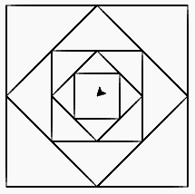

# Programy rekurencyjne produkujące coś tam graficzne

- fd() [forward] - naprzód
- bk() [backward] - wstecz
- rt(x) [right] - prawo
- lt(x) [left] - lewo
- pu() [put up] - podnieś pisak
- pd() [put down] - opuść pisak

```py
from turtle import *

def hop(x,y):
  pu()
  fd(x);lt(90)
  fd(y);rt(90)
  pd()
  
def kwadrat(bok):
  hop(-bok / 2, -bok /2)
  for i in range(4):
    fd(bok), lt(90)
  hop(bok / 2, bok /2)
  
kwadrat(200)
```


```py
from turtle import *
from math import sqrt

def hop(x,y):
  pu()
  fd(x);lt(90)
  fd(y);rt(90)
  pd()
  
def kwadrat(bok):
  hop(-bok / 2, -bok /2)
  for i in range(4):
    fd(bok), lt(90)
  hop(bok / 2, bok /2)

def kwadraty1(n, bok):
  if n == 0:
    return
  kwadrat(bok)
  lt(45)
  kwadraty1(n-1, bok / sqrt(2))

def kwadraty(n):
  kwadraty1(n, 200)
  
kwadraty(5)
```



```py
from turtle import *

speed(100)

def spirala1(n,bok):
  if n == 0:
    return
  fd(bok); lt(90)
  spirala1(n - 1, bok + 6)
  
def spirala(n):
  spirala1(n, 10)

spirala(19)
```

